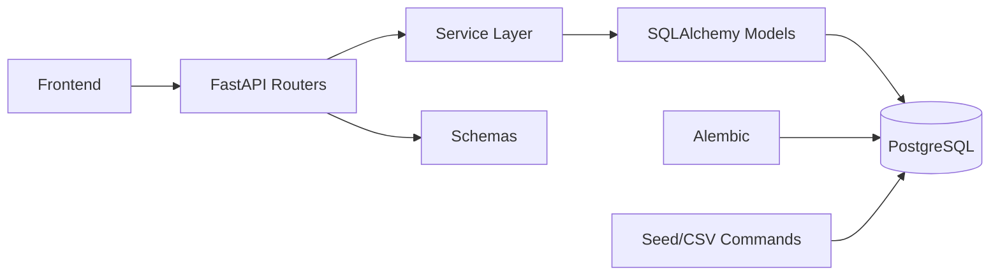
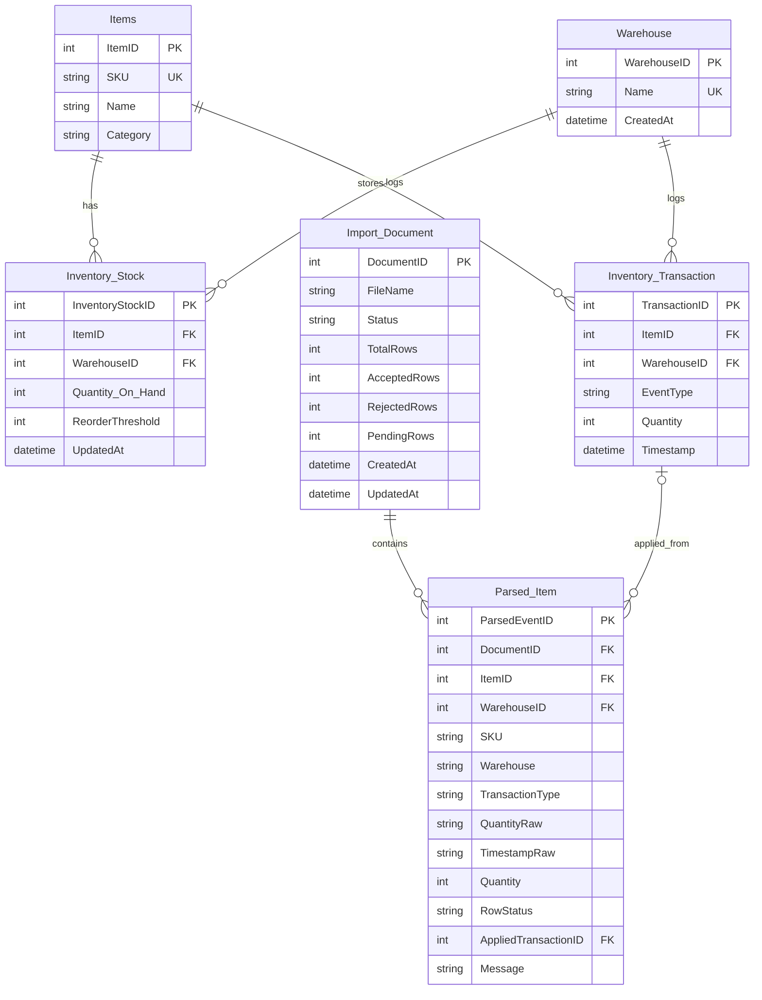
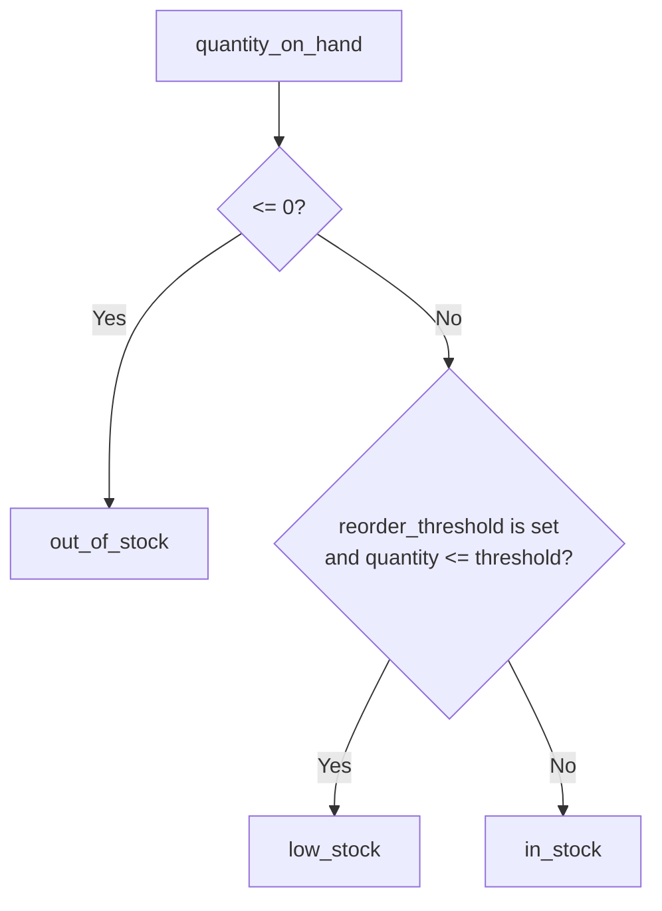
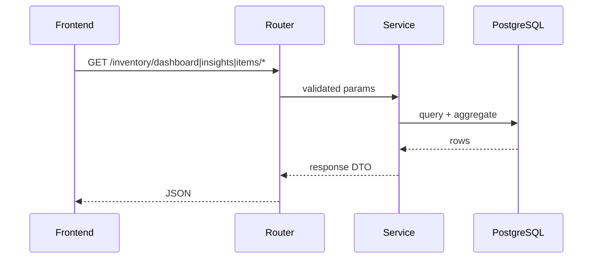
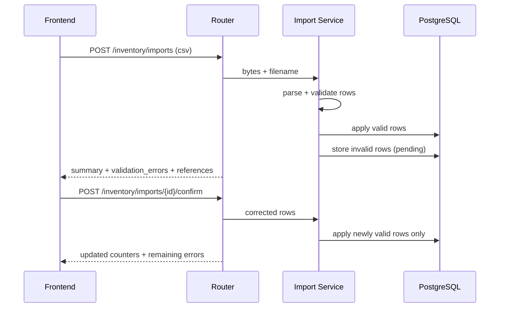

# Inventory Backend

FastAPI + PostgreSQL backend for inventory listing, insights, and CSV transaction import with validation/confirmation.

## Architecture



## ERD



## Business Rules



- Transaction types: `restock`, `sale`, `adjustment`
- Import strategy: partial success (valid applied, invalid pending)

## Main Flows

### Read Flow



### Import Flow



## Project Map

```text
src/app/api/v1/endpoints/   # HTTP routes
src/app/services/           # business logic
src/app/schemas/            # request/response contracts
src/app/models/             # ORM models
alembic/versions/           # schema migrations
src/command/                # seed and CSV generation
tests/                      # baseline tests
```

## API Surface

- `GET /api/v1/health`
- `GET /api/v1/health/db`
- `GET /api/v1/inventory/dashboard`
- `GET /api/v1/inventory/insights`
- `POST /api/v1/inventory/imports`
- `POST /api/v1/inventory/imports/{document_id}/confirm`
- `GET /api/v1/inventory/items/{item_id}/details`
- `GET /api/v1/inventory/items/by-sku/{sku}/details`

Docs: `http://localhost:8000/docs`

## Setup

```bash
python3 -m venv .venv
source .venv/bin/activate
.venv/bin/pip install fastapi uvicorn sqlalchemy alembic psycopg psycopg-binary python-dotenv python-multipart pydantic
cp .env.example .env
alembic upgrade head
PYTHONPATH=src uvicorn app.main:app --reload --host 0.0.0.0 --port 8000
```

## Test & Data Commands

```bash
# tests
.venv/bin/pip install pytest
PYTHONPATH=src .venv/bin/python -m pytest -q

# seed
PYTHONPATH=src .venv/bin/python -m command.seed_data --mode reset --size medium --seed 42

# csv fixture generation
PYTHONPATH=src .venv/bin/python -m command.generate_transactions_csv --rows 400 --invalid-ratio 0.1 --seed 42
```

## Assumptions / Tradeoffs

- `ReorderThreshold` nullable by design (future intelligence feature).
- No auth layer (assessment scope).
- Supplier section is placeholder in item details (no supplier table).
- Known issue: `GET /inventory/insights` has a PostgreSQL grouping edge case to fix.
