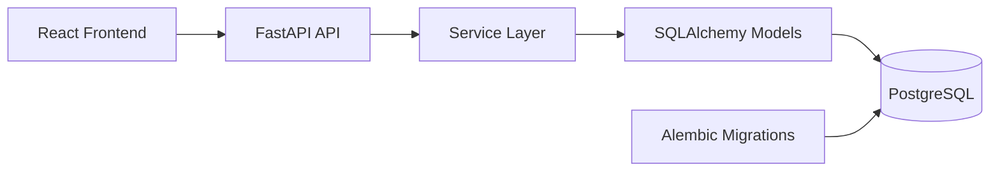

# Warehouse Inventory Full Stack

Monorepo containing:
- `backend_python`: FastAPI + PostgreSQL inventory API
- `react_fe/warehouse_fe`: React + TypeScript frontend
- `docker-compose.yml`: full-stack local runtime using published Docker images

## Tech Stack

### Backend (`backend_python`)
- FastAPI
- SQLAlchemy
- Alembic
- PostgreSQL

### Frontend (`react_fe/warehouse_fe`)
- React 19
- TypeScript
- Vite
- React Router
- Recharts

## Architecture



## Folder Structure

```text
.
├── backend_python/
│   ├── src/
│   │   ├── app/
│   │   │   ├── api/v1/endpoints/      # route handlers
│   │   │   ├── services/              # domain/business logic
│   │   │   ├── schemas/               # request/response DTOs
│   │   │   ├── models/                # ORM entities
│   │   │   ├── db/                    # engine/session/base
│   │   │   └── core/                  # env/config loading
│   │   └── command/                   # seed + csv generators
│   ├── alembic/
│   ├── tests/
│   ├── Dockerfile
│   └── README.md
├── react_fe/
│   └── warehouse_fe/
│       ├── public/
│       ├── src/
│       │   ├── component/             # shared UI (Header, etc.)
│       │   ├── page/
│       │   │   ├── list/              # dashboard/list module
│       │   │   ├── item-details/      # SKU detail module
│       │   │   └── insight/           # analytics module
│       │   ├── App.tsx
│       │   └── main.tsx
│       ├── Dockerfile
│       ├── nginx.conf
│       └── README.md
├── docker-compose.yml
└── README.md
```

## API Endpoints

- `GET /api/v1/health`
- `GET /api/v1/health/db`
- `GET /api/v1/inventory/dashboard`
- `GET /api/v1/inventory/insights`
- `POST /api/v1/inventory/imports`
- `POST /api/v1/inventory/imports/{document_id}/confirm`
- `GET /api/v1/inventory/items/{item_id}/details`
- `GET /api/v1/inventory/items/by-sku/{sku}/details`

## Quick Start (Recommended: Docker)

Prerequisites:
- Docker
- Docker Compose

Run the full stack:

```bash
cd /home/muhamad-daffa-azfa-rabbani/Public/JobAssement
docker compose up -d
```

Open:
- Frontend: `http://localhost:8080`
- Backend docs: `http://localhost:8000/docs`

Check health:

```bash
curl http://localhost:8000/api/v1/health
curl http://localhost:8080/api/v1/health
```

Stop:

```bash
docker compose down
```

Reset DB volume data:

```bash
docker compose down -v
```

## Local Development Setup (Without Docker)

### 1) Backend

```bash
cd backend_python
python3 -m venv .venv
source .venv/bin/activate
pip install -r requirements.txt
cp .env.example .env
alembic upgrade head
PYTHONPATH=src python -m command.seed_data --mode reset --size medium --seed 42
PYTHONPATH=src uvicorn app.main:app --reload --host 0.0.0.0 --port 8000
```

### 2) Frontend

In a new terminal:

```bash
cd react_fe/warehouse_fe
npm install
printf "BACKEND_URL=http://localhost:8000\n" > .env
npm run dev
```

Open:
- Frontend dev server: `http://localhost:5173`

## Test Commands

### Backend tests

```bash
cd backend_python
PYTHONPATH=src .venv/bin/python -m pytest -q
```

### Frontend build check

```bash
cd react_fe/warehouse_fe
npm run build
```

## Notes

- Backend container runs migrations on startup.
- Current docker compose config seeds sample data on backend startup (`RUN_SEED=true`, `SEED_MODE=reset`).
- App images in compose are pinned to Docker Hub tags:
  - `asoatram/backend-python:v1.0.0`
  - `asoatram/warehouse-fe:v1.0.0`
