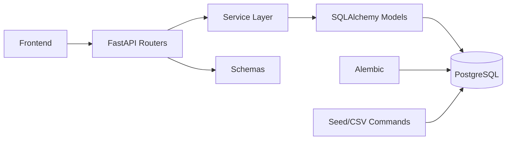
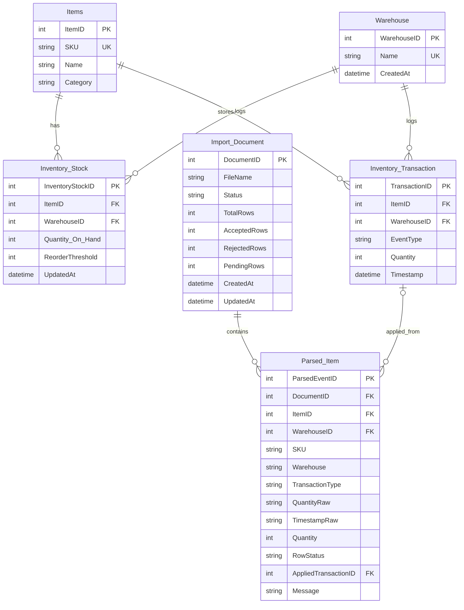
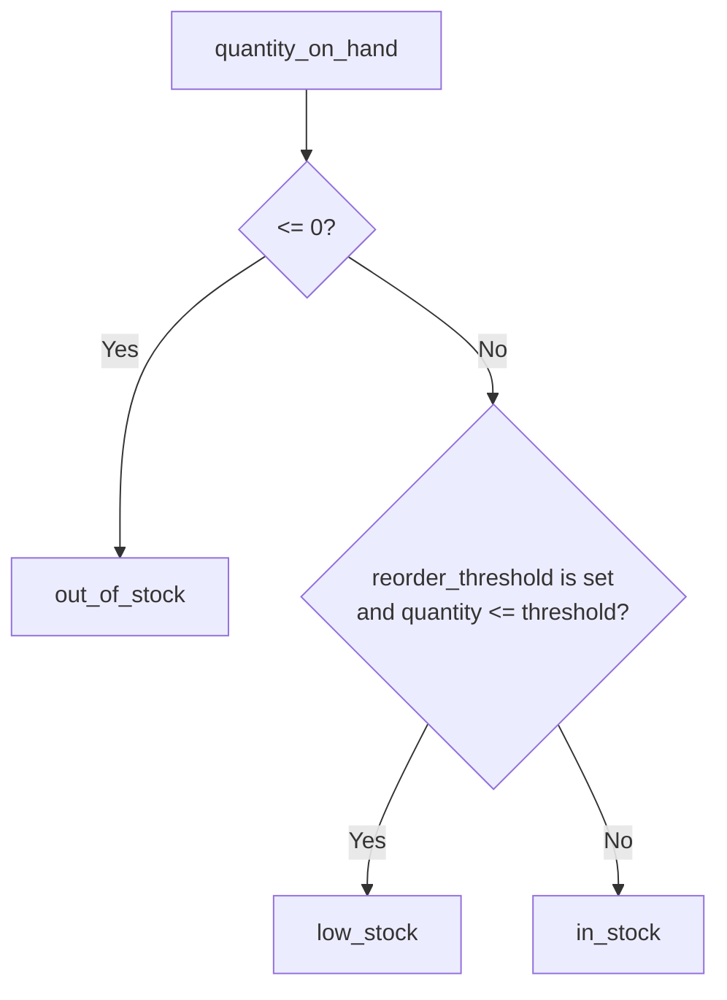
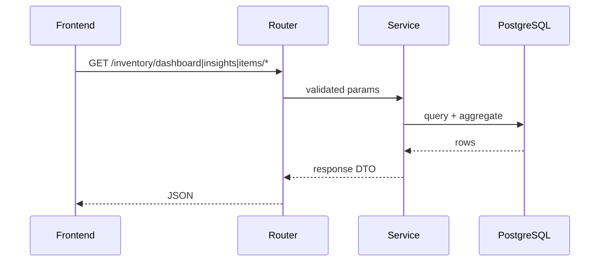
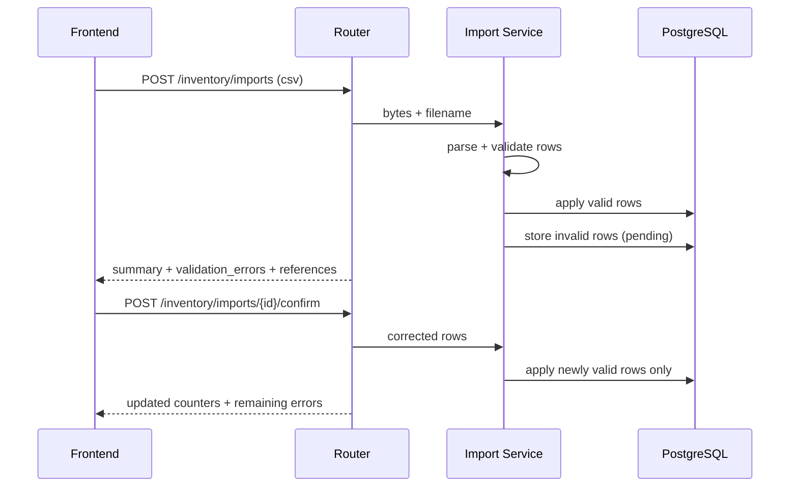

# Inventory Full Stack

FastAPI + PostgreSQL backend with React frontend for inventory listing, insights, and CSV transaction import with validation/confirmation.

## Architecture



### Layer Boundaries

- `api/v1/endpoints`: HTTP boundary only (parse input, return HTTP status/JSON).
- `services`: business rules and query orchestration.
- `schemas`: explicit request/response contracts.
- `models`: persistence model + constraints.
- `alembic`: schema evolution.
- `command`: operational scripts (seed/generate CSV).

## ERD



## Business Rules



- Transaction types: `restock`, `sale`, `adjustment`
- Import strategy: partial success (valid applied, invalid pending)
- Low stock is triggered when:
  - `quantity_on_hand <= 0` -> `out_of_stock`
  - `quantity_on_hand <= reorder_threshold` -> `low_stock` (when threshold exists)
- Reorder threshold calculation (per item + warehouse):
  - Formula:
    - `avg_daily_sales = sum_sales(window_days) / window_days`
    - `reorder_threshold = ceil(avg_daily_sales * lead_time_days * safety_factor)`
  - Parameter values (v1):
    - `window_days = 30`
    - `lead_time_days = 7`
    - `safety_factor = 1.25`
    - no-sales fallback threshold = `5`
    - max threshold cap = `500`

## Main Flows

### Read Flow



### Import Flow



## Project Structure

```text
.
├── backend_python/
│   ├── src/
│   │   ├── app/
│   │   │   ├── api/v1/endpoints/      # route handlers
│   │   │   ├── services/              # domain logic
│   │   │   ├── schemas/               # API DTOs
│   │   │   ├── models/                # ORM entities
│   │   │   ├── db/                    # engine/session/base
│   │   │   └── core/                  # config/env loading
│   │   └── command/                   # seed + CSV generators
│   ├── alembic/
│   │   ├── env.py                     # migration runtime config
│   │   └── versions/                  # migration revisions
│   ├── tests/                         # unit/API baseline tests
│   ├── data/csv/                      # generated CSV fixtures
│   ├── Dockerfile
│   └── README.md
├── react_fe/
│   └── warehouse_fe/
│       ├── public/                    # static assets
│       ├── src/
│       │   ├── component/             # shared app-level UI
│       │   ├── page/
│       │   │   ├── list/              # inventory list module
│       │   │   ├── item-details/      # item details module
│       │   │   └── insight/           # insights module
│       │   ├── App.tsx                # route definitions + app shell
│       │   └── main.tsx               # React bootstrap
│       ├── Dockerfile
│       ├── nginx.conf
│       └── README.md
├── docker-compose.yml
└── README.md
```

Suggested reading order:
1. `backend_python/src/app/api/v1/endpoints/inventory.py`
2. `backend_python/src/app/services/`
3. `backend_python/src/app/models/` + `backend_python/alembic/versions/`
4. `react_fe/warehouse_fe/src/page/`

## API Surface

- `GET /api/v1/health`
- `GET /api/v1/health/db`
- `GET /api/v1/inventory/dashboard`
- `GET /api/v1/inventory/insights`
- `POST /api/v1/inventory/imports`
- `POST /api/v1/inventory/imports/{document_id}/confirm`
- `GET /api/v1/inventory/items/{item_id}/details`
- `GET /api/v1/inventory/items/by-sku/{sku}/details`

Docs: `http://localhost:8000/docs`

## Setup

### Option A: Docker (recommended)

```bash
docker compose up -d
```

Open:
- Frontend: `http://localhost:8080`
- Backend docs: `http://localhost:8000/docs`

Stop:

```bash
docker compose down
```

Reset DB data:

```bash
docker compose down -v
```

`backend` image startup now runs threshold recalculation automatically (`RUN_RECALCULATE_THRESHOLD=true` by default).

### Option B: Local development (without Docker)

Backend:

```bash
cd backend_python
python3 -m venv .venv
source .venv/bin/activate
.venv/bin/pip install -r requirements.txt
cp .env.example .env
alembic upgrade head
PYTHONPATH=src .venv/bin/python -m command.seed_data --mode reset --size medium --seed 42
PYTHONPATH=src .venv/bin/python -m command.recalculate_reorder_thresholds
PYTHONPATH=src uvicorn app.main:app --reload --host 0.0.0.0 --port 8000
```

Frontend (new terminal):

```bash
cd react_fe/warehouse_fe
npm install
printf "BACKEND_URL=http://localhost:8000\n" > .env
npm run dev
```

## Test & Data Commands

```bash
# backend tests
cd backend_python
PYTHONPATH=src .venv/bin/python -m pytest -q

# csv fixture generation
PYTHONPATH=src .venv/bin/python -m command.generate_transactions_csv --rows 400 --invalid-ratio 0.1 --seed 42

# frontend build check
cd ../react_fe/warehouse_fe
npm run build
```

## Assumptions

- Authentication already exists at app/platform level; this backend focuses only on inventory domain logic.
- Supplier-per-SKU data already exists in another service/source; current backend keeps supplier as placeholder only.
- `ReorderThreshold` is nullable because threshold is derived from sales behavior and can be computed later.

## Tradeoffs / Limitations

- No authentication/authorization middleware in this service layer (RBAC not implemented here).
- Reorder threshold uses fixed lead-time and safety parameters because supplier lead-time is not modeled yet.
- Insights are optimized for current dashboard requirements, not full BI analytics coverage.
- SKU image assets are not stored/served in item details yet.

## Improvements With More Time

- Implement dynamic resupply logic using real supplier lead-time + service-level targets.
- Add authentication and authorization (RBAC) at endpoint level.
- Expand insights charts (fastest-selling and slowest-selling stock trends).
- Add image support per SKU on item detail responses.
